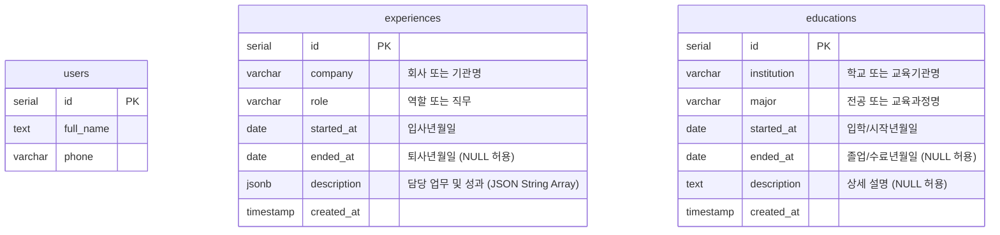

# Database Entity Relationship Diagram (ERD)

이 문서는 포트폴리오 웹사이트의 경력 및 학력 관리를 위한 데이터베이스 ERD 설계 문서입니다.

## Mermaid ERD

## 테이블 상세 명세

### 1. `experiences` (경력 정보 테이블)

| 컬럼명 | 데이터 타입 | 제약 조건 | 설명 |
| :--- | :--- | :--- | :--- |
| `id` | `serial` | `PRIMARY KEY` | 고유 식별자 |
| `company` | `varchar(256)` | `NOT NULL` | 회사 또는 기관명 (예: '테크 스타트업 플래너') |
| `role` | `varchar(256)` | `NOT NULL` | 담당 역할 또는 직무 (예: '서비스 기획 및 PM') |
| `started_at` | `date` | `NOT NULL` | 입사일 (년-월-일) |
| `ended_at` | `date` | `NULLABLE` | 퇴사일 (년-월-일, NULL일 경우 '현재'로 취급) |
| `description` | `jsonb` | `NOT NULL` | 업무 성과 내용 목록 (배열 형태 `["성과 1", "성과 2"]`) |
| `created_at` | `timestamp` | `DEFAULT now()` | 데이터 생성 일시 |

### 2. `educations` (학력 및 교육 정보 테이블)

| 컬럼명 | 데이터 타입 | 제약 조건 | 설명 |
| :--- | :--- | :--- | :--- |
| `id` | `serial` | `PRIMARY KEY` | 고유 식별자 |
| `institution` | `varchar(256)` | `NOT NULL` | 학교 또는 교육기관명 (예: '한국대학교') |
| `major` | `varchar(256)` | `NOT NULL` | 전공 또는 과정명 (예: '경영학과') |
| `started_at` | `date` | `NOT NULL` | 입학일 또는 수강 시작일 (년-월-일) |
| `ended_at` | `date` | `NULLABLE` | 졸업일 또는 수료일 (년-월-일, NULL 허용) |
| `description` | `text` | `NULLABLE` | 교육과정 관련 추가 성과 및 상세 설명 |
| `created_at` | `timestamp` | `DEFAULT now()` | 데이터 생성 일시 |
